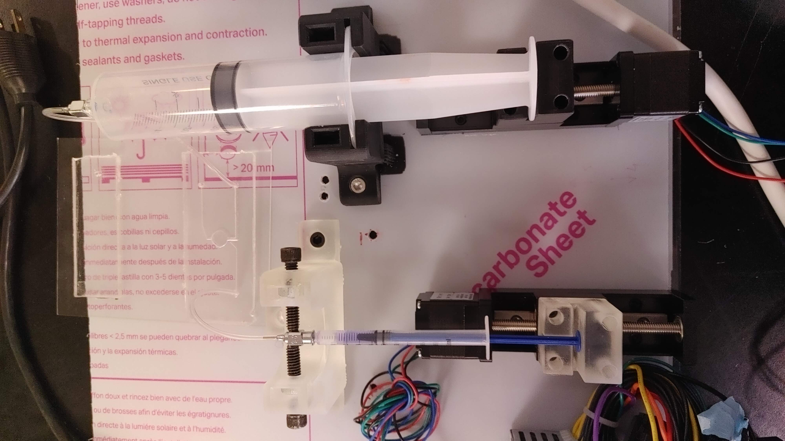

# MultiStepperSyringePump

This repo contains an Arduino code to operate multiple stepper motors for their application as an automatic syringe pump.

Serial Inputs:  
a---> Enter distance linear guide 'a' has to move in mm :  
b---> Enter distance linear guide 'b' has to move in mm :  
g---> Run motor 'a' by a specific distance then wait for a 'period' and then run motor 'b' by a specific distance. Note: specific distances are hard coded and can be changed by modifying the code  
s---> Stop all the motors   

Output:
- multiple stepper motors run individually and/or simultaneously depending on the serial input.

Check out the system in operation: https://www.youtube.com/watch?v=T5XUcyTErbg&ab_channel=maheshlokhande

Component list:
Linear rails/guides: [Bought from Banggood](https://www.banggood.com/50-or-100-or-150-or-200mm-T6-Linear-CNC-Slide-Stage-Actuator-Motor-Stepper-Stroke-Actuator-p-1526426.html?cur_warehouse=CN&ID=47877&utm_design=18&utm_email=1610990372_2332&utm_source=emarsys&utm_medium=Neworder171109&utm_campaign=trigger-order&utm_content=linux&sc_src=email_2675773&sc_eh=6bb8226746072b581&sc_llid=28998421&sc_lid=105229698&sc_uid=QjS1DuFkYC)

